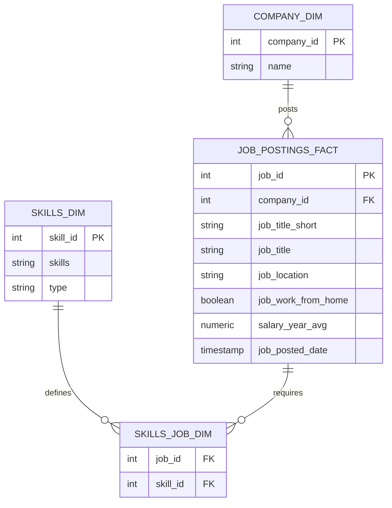

# 📊 SQL Job Market Analysis (2023)

[](https://www.postgresql.org/)
[](#)
[](https://git-scm.com/)
[](https://opensource.org/licenses/MIT)

An end-to-end data analytics project using **PostgreSQL** to analyze the **2023 Software Engineering job market**. This project explores thousands of job postings to identify top-paying roles, most in-demand technologies, and optimal skills that offer the strongest return on investment (high demand + high compensation).

---

## 🎯 Business Questions & Objectives

1. **Top-Paying Roles**: What are the highest-paying remote Software Engineer roles?
2. **Skills for Top-Paying Roles**: What specific technical competencies do top-paying employers demand?
3. **Most In-Demand Skills**: Which skills appear most frequently across all remote Software Engineering postings?
4. **Top Skills by Salary**: Which specialized skills command the highest average salaries?
5. **Most Optimal Skills**: Which skills provide the sweet spot of **high market demand** and **high compensation**?

---

## 🛠️ Tools & Technologies

* **Database Engine**: [PostgreSQL](https://www.postgresql.org/)
* **Query Language**: SQL (CTEs, Aggregate Analysis, Multi-Table Joins)
* **Development Environment**: VS Code, pgAdmin 4
* **Version Control**: Git & GitHub

### SQL Techniques Applied
* **Common Table Expressions (CTEs)** (`WITH` clauses for clean multi-stage data transformations)
* **Complex Joins** (`INNER JOIN`, `LEFT JOIN` linking fact and dimension tables)
* **Aggregation & Filtering** (`COUNT()`, `AVG()`, `ROUND()`, `GROUP BY`, `HAVING`, `WHERE`)
* **Ranking & Ordering** (`ORDER BY ... DESC`, `LIMIT`)
* **String Pattern Matching** (`ILIKE`)

---

## 🗄️ Database Architecture & Schema

The data model follows a star-like relational schema optimized for querying job listings, companies, and associated skills:



---

## 📁 Project Structure

```text
SQL_Job_Analysis_2023/
│
├── analysis/
│   ├── 1_top_paying_jobs.sql           # Query 1: Top 10 highest-paying remote roles
│   ├── 2_top_paying_job_skills.sql     # Query 2: Skills required for top-paying roles
│   ├── 3_top_demanded_skills.sql       # Query 3: Most frequent skills across postings
│   ├── 4_top_paying_skills.sql         # Query 4: Highest average salaries by skill
│   └── 5_optimal_skills.sql            # Query 5: Optimal skills (demand + salary balance)
│
├── sql_load/
│   ├── 1_create_database.sql           # Database initialization
│   ├── 2_create_tables.sql             # Table schemas (fact & dimensions)
│   └── 3_modify_tables.sql             # Bulk data load scripts (COPY commands)
│
├── .gitignore
└── README.md
```

---

## 🔍 Detailed Analysis & SQL Walkthrough

---

### 1️⃣ What are the top-paying remote Software Engineering jobs?

* **File**: [`analysis/1_top_paying_jobs.sql`](./analysis/1_top_paying_jobs.sql)
* **Goal**: Identify the 10 highest-paying remote Software Engineering positions with verified salary data.

```sql
SELECT 
    j.job_id,
    j.job_title,
    c.name AS company_name,
    j.job_schedule_type,
    j.salary_year_avg,
    j.job_posted_date
FROM job_postings_fact j
LEFT JOIN company_dim c ON j.company_id = c.company_id
WHERE j.job_title_short ILIKE '%software%engineer%'
    AND j.job_location = 'Anywhere'
    AND j.salary_year_avg IS NOT NULL
ORDER BY j.salary_year_avg DESC
LIMIT 10;
```

#### 📊 Sample Findings
| Job ID | Job Title | Company | Avg Annual Salary |
| :--- | :--- | :--- | :---: |
| `562251` | Senior Software Engineer | Datavant | **$225,000** |
| `1356375` | Senior Software Engineer, Full Stack | SmarterDx | **$205,000** |
| `365528` | Engineering | Huckleberry Labs | **$205,000** |

> 💡 **Insight**: Top remote salaries exceed **$200,000/year**, with leadership and specialized full-stack/senior engineering titles commanding the highest pay scale.

---

### 2️⃣ What skills are required for the top-paying jobs?

* **File**: [`analysis/2_top_paying_job_skills.sql`](./analysis/2_top_paying_job_skills.sql)
* **Goal**: Determine which specific technologies are demanded by the highest-paying roles identified in Query 1.

```sql
WITH top_paying_jobs AS (
    SELECT 
        j.job_id,
        j.job_title,
        c.name AS company_name,
        j.salary_year_avg
    FROM job_postings_fact j
    LEFT JOIN company_dim c ON j.company_id = c.company_id
    WHERE j.job_title_short ILIKE '%software%engineer%'
        AND j.job_location = 'Anywhere'
        AND j.salary_year_avg IS NOT NULL
)
SELECT 
    top_j.job_id,
    top_j.job_title,
    s.skills,
    top_j.company_name,
    top_j.salary_year_avg
FROM top_paying_jobs top_j
INNER JOIN skills_job_dim sj ON top_j.job_id = sj.job_id
INNER JOIN skills_dim s ON sj.skill_id = s.skill_id
ORDER BY top_j.salary_year_avg DESC;
```

#### 📊 Key Skill Frequencies in Top Roles
* **Languages**: JavaScript, TypeScript, Python, Java
* **Cloud & Infrastructure**: AWS, Azure, Elasticsearch, Snowflake
* **Frameworks**: React, Spark

> 💡 **Insight**: Top-paying roles require a hybrid skill set: core programming languages paired with modern cloud data platforms and distributed frameworks.

---

### 3️⃣ What are the most in-demand skills overall?

* **File**: [`analysis/3_top_demanded_skills.sql`](./analysis/3_top_demanded_skills.sql)
* **Goal**: Identify the skills appearing with the highest volume across all remote postings.

```sql
WITH skills_wanted AS (
    SELECT 
        s.skill_id,
        s.skills AS skill_name,
        COUNT(sj.job_id) AS skills_count
    FROM skills_dim s
    JOIN skills_job_dim sj ON sj.skill_id = s.skill_id
    JOIN job_postings_fact j ON j.job_id = sj.job_id
    WHERE j.job_work_from_home = TRUE
        AND j.job_title_short = 'Software Engineer'
    GROUP BY s.skill_id, s.skills
)
SELECT *
FROM skills_wanted
ORDER BY skills_count DESC
LIMIT 5;
```

#### 📊 Top 5 In-Demand Skills
| Rank | Skill | Job Postings Count |
| :---: | :--- | :---: |
| 1 | **Python** | 1,318 |
| 2 | **SQL** | 1,038 |
| 3 | **AWS** | 1,007 |
| 4 | **Java** | 741 |
| 5 | **Kubernetes** | 618 |

> 💡 **Insight**: Python and SQL form the foundational core of engineering job requirements, while AWS and Kubernetes highlight the critical need for cloud-native deployment skills.

---

### 4️⃣ What are the top skills based on average salary?

* **File**: [`analysis/4_top_paying_skills.sql`](./analysis/4_top_paying_skills.sql)
* **Goal**: Uncover which technical skills carry the highest salary premiums regardless of posting count.

```sql
SELECT 
    s.skills AS skill_name,
    ROUND(AVG(j.salary_year_avg), 0) AS avg_salary
FROM job_postings_fact AS j
JOIN skills_job_dim AS sj ON j.job_id = sj.job_id
JOIN skills_dim AS s ON sj.skill_id = s.skill_id
WHERE j.job_title_short = 'Software Engineer'
    AND j.salary_year_avg IS NOT NULL
GROUP BY s.skills
ORDER BY avg_salary DESC
LIMIT 10;
```

#### 📊 Highest-Paying Skills
| Skill | Category | Average Salary |
| :--- | :--- | :---: |
| **Cassandra** | NoSQL Database | **$213,333** |
| **Debian** | OS / Infrastructure | **$196,500** |
| **Neo4j** | Graph Database | **$183,840** |
| **Couchbase** | NoSQL Database | **$166,250** |
| **Assembly** | Low-Level Language | **$157,188** |
| **ASP.NET Core** | Web Framework | **$155,000** |
| **Ruby on Rails** | Web Framework | **$149,500** |
| **DynamoDB** | Cloud Database | **$148,813** |
| **Node** | Runtime / Backend | **$145,147** |
| **Go** | Backend Language | **$142,748** |

> 💡 **Insight**: Niche distributed database technologies (Cassandra, Neo4j, Couchbase) and systems programming languages command significant compensation premiums due to talent scarcity.

---

### 5️⃣ What are the most optimal skills to learn? (High Demand + High Salary)

* **File**: [`analysis/5_optimal_skills.sql`](./analysis/5_optimal_skills.sql)
* **Goal**: Identify technologies that offer the best strategic combination of high job security (demand > 10 postings) and top-tier compensation.

```sql
SELECT 
    s.skill_id,
    s.skills AS skill_name,
    COUNT(*) AS job_count,
    ROUND(AVG(j.salary_year_avg), 0) AS avg_salary
FROM job_postings_fact AS j
JOIN skills_job_dim AS sj ON j.job_id = sj.job_id
JOIN skills_dim AS s ON sj.skill_id = s.skill_id
WHERE j.job_title_short = 'Software Engineer'
    AND j.job_work_from_home = TRUE
    AND j.salary_year_avg IS NOT NULL
GROUP BY s.skill_id, s.skills
HAVING COUNT(*) > 10
ORDER BY avg_salary DESC, job_count DESC
LIMIT 10;
```

#### 📊 The Optimal Skills Matrix
| Skill | Job Demand (Postings) | Average Salary | Strategic Category |
| :--- | :---: | :---: | :--- |
| **TypeScript** | 14 | **$142,143** | Modern Full-Stack |
| **JavaScript** | 16 | **$137,000** | Web Core |
| **Python** | 32 | **$132,266** | General / Backend / Data |
| **GCP** | 11 | **$128,351** | Cloud Architecture |
| **AWS** | 21 | **$125,143** | Cloud Architecture |
| **SQL** | 30 | **$112,729** | Database Core |
| **Docker** | 13 | **$94,308** | Containerization |

> 💡 **Insight**: While niche skills pay more in isolation, **TypeScript**, **Python**, and **AWS** represent the optimal career investments—delivering both high hiring volume and strong six-figure salaries.

---

## 💡 Strategic Takeaways

1. **Volume vs. Premium Trade-off**:
   * *High-volume skills* (Python, SQL) ensure maximum employment opportunities.
   * *High-yield skills* (Go, TypeScript, Cloud Platforms) unlock upper-bracket compensation.
2. **Cloud Dominance**:
   * AWS and GCP are recurring salary multipliers across both full-stack and backend roles.
3. **Full-Stack & Backend Modernization**:
   * Modern JavaScript/TypeScript ecosystems paired with containerization (Docker, Kubernetes) form the baseline expectation for top remote engineering tiers.

---

## ⚙️ How to Set Up and Run the Project

### Prerequisites
* [PostgreSQL](https://www.postgresql.org/download/) (v14+ recommended)
* A SQL client such as [VS Code SQLTools](https://marketplace.visualstudio.com/items?itemName=mtxr.sqltools) or [pgAdmin](https://www.pgadmin.org/)

### 1. Clone the Repository
```bash
git clone https://github.com/Amr866/SQL_Job_Analysis_2023.git
```

### 2. Set Up the Database & Tables
Execute the setup scripts in sequential order:
1. Run [`sql_load/1_create_database.sql`](./sql_load/1_create_database.sql) to initialize the database.
2. Run [`sql_load/2_create_tables.sql`](./sql_load/2_create_tables.sql) to create table schemas.
3. Run [`sql_load/3_modify_tables.sql`](./sql_load/3_modify_tables.sql) to load the CSV dataset.

### 3. Run Analysis Queries
Open any query file in [`analysis/`](./analysis/) to reproduce the analysis.

---

## ⚠️ Limitations & Disclaimers

* **Temporal Scope**: Data represents a snapshot of the 2023 job market.
* **Salary Reporting**: Only a subset of job postings disclose exact salary figures.
* **Outliers & Sample Sizes**: Niche technologies with few postings may skew high; findings reflect correlation with compensation rather than direct causation.

---

## 📚 Data Source & Acknowledgments

* Dataset provided through **Luke Barousse's SQL for Data Analytics** course.

---

## 👤 Author

* **Amir**
* **GitHub**: [@Amr866](https://github.com/Amr866)
